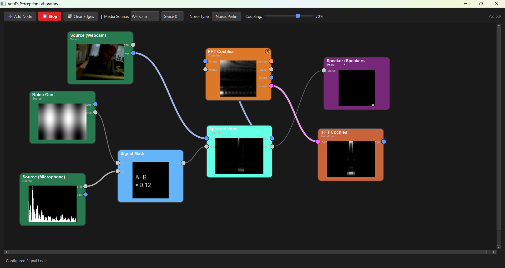

# Antti's Perception Laboratory

A real-time, node-based interface for multi-domain perception experiments and generative art.

This tool provides a visual, "patch-cable" environment for experimenting with live data streams. It's built for artists, researchers, and hobbyists to explore the "fun fun fun" connections between different sensory domains in real-time.

This is a laboratory for live Digital Signal Processing (DSP), not AI inference. It's designed for processing live webcam, microphone, and generated signals at high frame rates.

# 📸 Features

Real-Time Processing: Runs at 30+ FPS for smooth, interactive experimentation.

Node-Based Graph: Visually connect processing modules (nodes) to build complex effects.

Multi-Domain: Seamlessly convert between data types:

📷 Image: Live video, noise patterns.

🎧 Signal: Audio streams, control voltages, LFOs.

🧬 Frequency: Visual spectra (your "Visual Cochlea") and the complex data needed to reconstruct them.

Live I/O: Capture from any connected Webcam or Microphone and output sound directly to your Speakers.

Built-in Modules: Includes generators, FFT/iFFT, 3D particle systems, signal filters, math, and logic operators right out of the box.

Fully Configurable: Right-click any node to configure its parameters (e.g., change filter type, set logic threshold).

# 🚀 Getting Started

1. Requirements
This project uses Python and several common data-processing libraries.

You will need:

PyQt6 (for the interface)

numpy (for math)

opencv-python (for webcam and image processing)

pyqtgraph (for node graphics)

scipy (for FFTs)

Pillow (for display text)

pyaudio (for microphone and speaker access)

# 2. Installation
You can install all requirements using pip:

pip install PyQt6 numpy opencv-python pyqtgraph scipy Pillow pyaudio

# 3. Running the Lab

Save the complete code as a Python file (e.g., perception_lab.py).

Run it from your terminal:

python anttis_perception_lab.py

# 🕹️ How to Use

Add Node: Right-click on the empty grid to open the node menu.

Connect Nodes: Click and drag from an output port (right side of a node) to a compatible input port (left side).

Delete Node: Click a node to select it, then press the Delete or Backspace key.

Configure Node: Right-click on a node's body to open its ⚙ Configure Node... menu.

Start/Stop: Press the ▶ Start button in the toolbar to begin processing.

# 🔬 Available Nodes

🟢 Source Nodes

Media Source: Provides a live image and signal (luminance/volume) from a Webcam or Microphone.

Noise Generator: Generates image and signal noise (White, Brown, Perlin, Quantum).

🟡 Transform Nodes

FFT Cochlea: The "Visual Cochlea." Takes an image and outputs:

spectrum: An averaged 1D spectrum.

image: A 2D log-magnitude spectral map (for viewing).

complex_spectrum: The raw, complex data needed for inversion.

iFFT Cochlea: The inverse of the Cochlea. Takes a complex_spectrum and reconstructs an image.

Spectral Wipe: Applies a moving band-pass, low-pass, or high-pass filter to an image. Can be controlled by an input signal.

Signal Processor: A multi-tool for signals. Includes:

Smoothing (EMA)

Differentiation

Integration (Decay)

High-Pass Filter

Full Wave Rectify

Tanh Distortion

Signal Math: Takes two signals (A, B) and performs A + B, A - B, A * B, or A / B.

Signal Logic: An If/Then gate. If Test > Threshold, it outputs if_true; otherwise, it outputs if_false.

3D Scouts: A simple 3D particle swarm that reacts to image and spectrum inputs.

3D Attractor: A 3D particle system driven by two signal inputs.

🔴 Output Nodes
Image Display: A final viewport to display an image.

Signal Monitor: A simple oscilloscope that plots an incoming signal over time.

Speaker Output: Plays an incoming signal as live audio through your speakers.

# What inspired it.. 

I have ran a lot of sims through last few years.. Toy scientific sims.. I realized the best way to run them 
would be in environment like this. As nodes that are connected like in visual programming systems like ComfyUI . 
But that would require nodes to be modular and the system would become very heavy due to all nodes needing 
different imports etc. 

But it is if nothign else. . A platform that can be turned into virtual experiment lab.. Espeically in future, 
it might offer future ais a good thing to shoot for. Say, I want it like this with x y and z.. 

I imagine real scientists have things like this .. But since I am not one.. 

# Licence 

MIT
